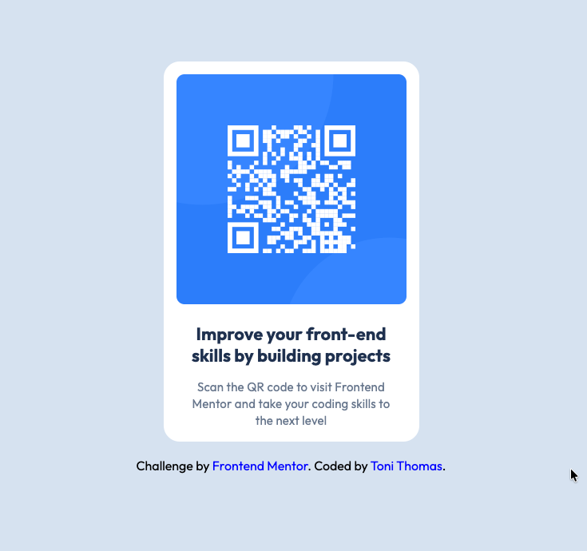

# Frontend Mentor - QR code component solution

This is a solution to the [QR code component challenge on Frontend Mentor](https://www.frontendmentor.io/challenges/qr-code-component-iux_sIO_H). In this project, I practiced translating a figma design to HTML & CSS. Check out my solution by [clicking here](https://ps-mod3-figma-qrcode.vercel.app/)!

## Table of contents

- [Screenshot](#screenshot)
- [Live link](#link)
- [What I learned](#what-i-learned)
- [Continued development](#continued-development)
- [Author](#author)
- [Reflection](#Reflection-questions)

### Screenshot

### Live Link
[QR-Code Live Link](https://ps-mod3-figma-qrcode.vercel.app/)

### What I learned

I learned how to read the typography styles in figma, to translate them to CSS. By clicking on the text, the toolbar on the right hand size shows the font-size, family, color, line-height, etc. I was able to then take these styles and apply them using CSS.

### Continued development

In the future, I will use this project to to practice integrating either bootstrap or tailwind.

### Author

- Website - [Toni Thomas](https://toni-thomas.vercel.app/)
- Frontend Mentor - [DiyBookOfLife](https://www.frontendmentor.io/profile/DiyBookOfLife)
- LinkedIn - [Toni Thomas](https://www.linkedin.com/in/tonithomas2025/)

## Reflection questions

**1. How did using Figma designs as references affect your coding process?**

- Using figma designs as a refence really helped with the coding process; it provided precise details about the styles instead of guessing based on appearance.

**2. What challenges did you encounter when aligning your code with the design specifications?**

- It was challenging trying to figure out the page and card measurements. When adding the width/height of the page, it broke the fluid layout of the card/container using flex so I focused on the typography instead.

**3. How can the feedback and community resources on Frontend Mentor help you improve as a developer?**

- The feedback and community resources exposes me to different solutions to the same problem. Seeing how other developers structure their layouts and style their code, helps me identify best practices.
